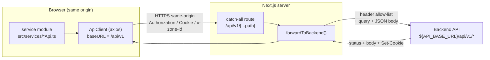
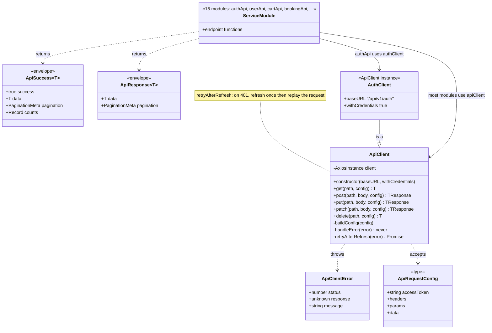
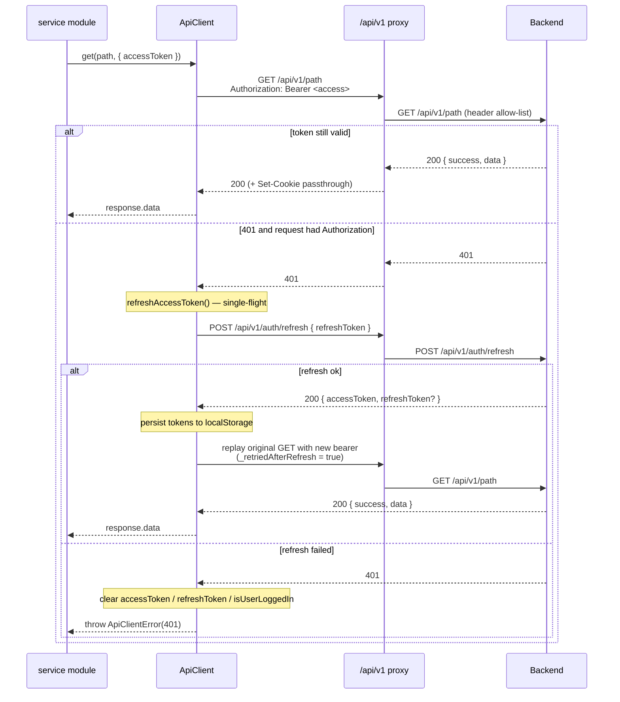
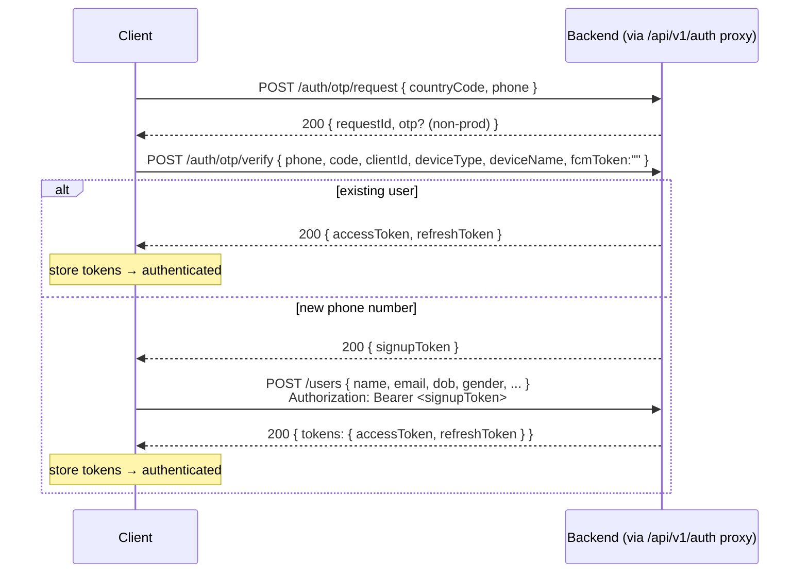
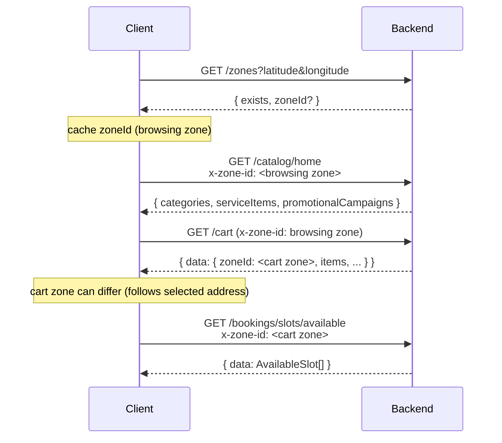
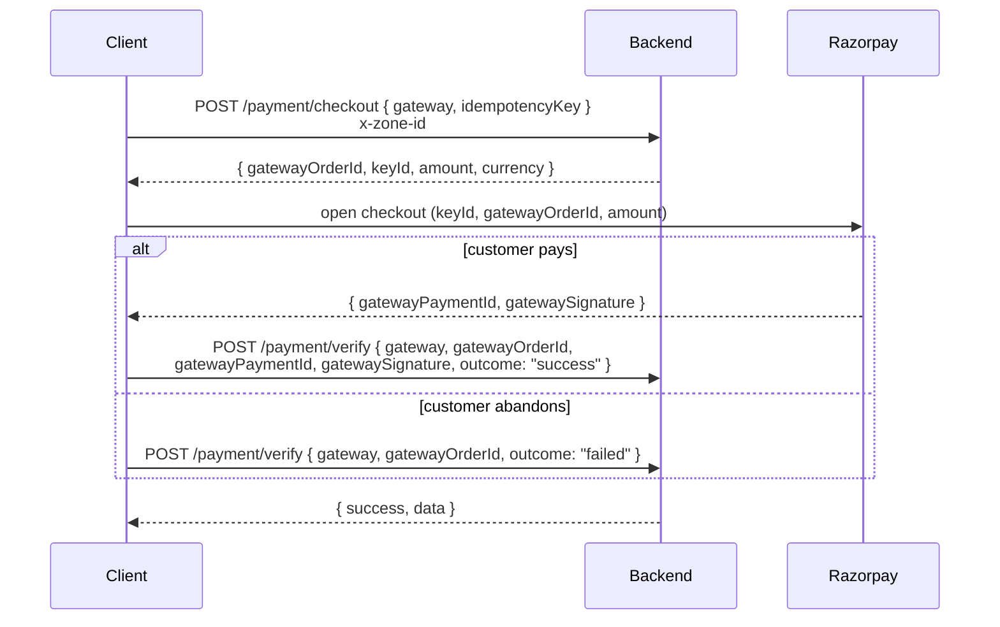

# Client API Flow

How an API request travels from the client codebase to the backend and
back. Covers the same-origin proxy, the shared HTTP client, auth/token
handling, zone scoping, response envelopes, and every endpoint the client
calls. UI/framework wiring is out of scope.

---

## 1. Request path

```
service module            src/services/*Api.ts        (typed endpoint functions)
  └─ ApiClient (axios)     src/lib/api/apiClient.ts    baseURL = /api/v1
       └─ Next route       src/app/api/v1/[...path]/route.ts   (same-origin proxy)
            └─ forwardToBackend   src/app/api/_lib/backend.ts
                 └─ backend       ${API_BASE_URL}/api/v1/...
```

The client **never** calls the backend cross-origin. Every request targets
the same-origin path `/api/v1/*`; a catch-all Next.js route proxies it to
the real backend. This keeps the auth session cookie first-party, avoids
CORS, and keeps the backend origin out of the client bundle.



> **Getting this into Excalidraw** — two options:
>
> 1. **Mermaid (most reliable).** `docs/api-flow.mmd` holds the request-flow
>    diagram as Mermaid. In Excalidraw open the top-left **menu ▸ Insert ▸
>    "Mermaid to Excalidraw"** (or the *Insert ▸ Mermaid* command), paste the
>    file contents (the `%%` comment lines are ignored), press **Insert**.
>    The same works for any fenced ```` ```mermaid ```` block in this doc —
>    paste just the code, without the fence lines — for the `flowchart`,
>    `sequenceDiagram`, and `classDiagram` blocks.
> 2. **Native file.** `docs/api-flow.excalidraw` is the same diagram as a
>    fully-bound Excalidraw scene. On **excalidraw.com** use *menu ▸ Open*
>    and pick the file (drag-and-drop also works but **replaces** the current
>    canvas). In the **VS Code Excalidraw extension**, right-click the file ▸
>    *Open With… ▸ Excalidraw editor*.

### API layer structure (UML class view)



---

## 2. Same-origin proxy

### `src/app/api/v1/[...path]/route.ts`

Catch-all handler exporting `GET`, `POST`, `PATCH`, `PUT`, `DELETE`. Each
rebuilds the backend path from the captured segments —
`/api/v1/${path.map(encodeURIComponent).join("/")}` — and delegates to
`forwardToBackend`.

### `src/app/api/_lib/backend.ts` — `forwardToBackend(request, path)`

| Concern | Behavior |
|---|---|
| Target base URL | `process.env.API_BASE_URL ?? process.env.NEXT_PUBLIC_API_BASE_URL`, trailing slash stripped. `500` if neither is set. |
| Request headers forwarded | `User-Agent: "Eezit Web Customer Portal"` (always); `Authorization`, `Cookie`, `x-zone-id` (each only if present on the incoming request). Nothing else is copied. |
| Request body | Non-GET/HEAD only. Empty body → forwarded with none (valid for `DELETE /cart/items/{id}`, some `PUT`/`PATCH`). Non-empty body must parse as JSON, else `400 "A valid JSON body is required."`; on success `Content-Type: application/json` is set. |
| Query string | Preserved verbatim. |
| Upstream fetch | `cache: "no-store"`. |
| Response | Status preserved. `Content-Type` copied from upstream (default `application/json`). Every upstream `Set-Cookie` is re-emitted. Network/fetch failure → `502 "Unable to reach the authentication service."` |

---

## 3. HTTP client

### `src/lib/api/apiClient.ts` — `class ApiClient`

- Constructor: `new ApiClient(baseURL = "/api/v1", withCredentials = false)`.
  Default headers: `Content-Type: application/json`,
  `ngrok-skip-browser-warning: 1`.
- Methods: `get<T>`, `post<TBody,TResponse>`, `put`, `patch`, `delete`.
  Each returns `response.data` (the parsed JSON envelope).
- Per-request config = axios config plus `accessToken?`. Passing
  `accessToken` adds `Authorization: Bearer <token>`. `params`, `headers`,
  and `data` (DELETE bodies) pass through to axios.
- Errors: any axios error is rethrown as **`ApiClientError`** with
  `.status` and `.response`; `.message` resolves
  `response.error.message` → `response.message` → generic fallback.
  Non-axios errors rethrow unchanged.

**Automatic 401 → refresh → retry** (`retryAfterRefresh`):

On a `401` the client refreshes the token once and replays the original
request. It gives up (original error surfaces) when the status is not
`401`, the request was already retried, the URL ends with `/refresh`, or
the original request carried no `Authorization` header.

`refreshAccessToken()`:

- Browser-only. Reads `refreshToken` from `localStorage`; absent → `null`.
- Single-flight: concurrent 401s share one in-flight
  `POST /api/v1/auth/refresh` (`{ refreshToken }`, `withCredentials`).
- Success → writes new `accessToken` (and `refreshToken` if returned) to
  `localStorage`.
- Failure → clears `accessToken`, `refreshToken`, `isUserLoggedIn` from
  `localStorage`, resolves `null`.

**`fetchAllPaginated(fetchPage, limit = 100)`**:

The backend paginates every list endpoint (default 20/page, max 100). This
helper fetches page 1, reads `pagination.totalPages`, walks pages 2..N, and
concatenates `.data` into one array. Used by `bookingApi.findAll` and
`serviceItemApi.getServiceItems`.

### Authenticated request with 401 recovery



### `src/lib/api/authClient.ts`

```ts
export const authClient = new ApiClient(`${API_V1_URL}/auth`, true);
```

Second instance scoped to `/api/v1/auth` with `withCredentials = true`
(auth endpoints set/require the server session cookie alongside the bearer
tokens). Only `authApi` uses it.

---

## 4. Auth & tokens

### Token storage (`localStorage`)

| Key | Set by | Meaning |
|---|---|---|
| `accessToken` | verify/create/refresh | JWT bearer token |
| `refreshToken` | verify/create/refresh | refresh token |
| `isUserLoggedIn` | login flow (`"true"`) | legacy flag; cleared on failed refresh |
| `fcmDeviceToken` | notification token registration | last FCM token sent to the backend |

`accessToken` is checked client-side by base64-decoding the JWT payload and
comparing `exp * 1000` to now (missing `exp` or decode failure ⇒ invalid).
No server-side revocation check.

### Login / signup endpoint sequence

1. `POST /auth/otp/request` — body `{ countryCode: "+91", phone }`.
   Non-prod echoes the code back in `data.otp`.
2. `POST /auth/otp/verify` — body
   `{ phone, countryCode, code, clientId: "uc_web_customer_portal",
   fcmToken: "", deviceType: "WEB", deviceName }`.
   - `data.accessToken` (+ `data.refreshToken`) ⇒ existing user, done.
   - `data.signupToken` ⇒ new number, continue to step 3.
3. `POST /users` with `Authorization: Bearer <signupToken>` — body
   `{ countryCode, name, email, profilePhotoKey, dateOfBirth, gender, referredBy? }`.
   Response: `data.tokens.{ accessToken, refreshToken }`.



### Logout

- `POST /auth/logout` — current session.
- `POST /auth/logout-all` — all sessions.

---

## 5. Zone scoping (`x-zone-id`)

Catalog and booking endpoints are location-scoped on the backend, which
reads the zone from the **`x-zone-id` request header only** (a query param
is silently ignored).

- The zone id is resolved from coordinates via `GET /zones?latitude&longitude`
  → `{ exists, zoneId? }`, then attached as `x-zone-id` on subsequent calls.
- Two zone values exist: the ambient **browsing zone** (used for catalog
  reads) and the **cart zone** the server pins the cart to (follows the
  selected address). Cart and slot calls use the cart zone; slot capacity
  checks and reservation must agree on it.
- Sent by: `homeApi`, `categoryApi`, `serviceItemApi`, `serviceSuiteApi`,
  `campaignApi`, `cartApi`, `paymentApi`, `bookingApi.getAvailableSlots`.
- Catalog endpoints are `@LocationRequired` (`FLEXIBLE` mode): the header is
  optional server-side (IP/Cloudflare-edge geo fallback), but a bare
  backend with no edge geo `404`s
  `"Service is not available in the requested region."` — so the client
  always sends `x-zone-id` when it has one.



---

## 6. Response envelopes

Hand-maintained (no shared types package with the backend).

```ts
// ApiSuccess<T> — auth / user / address / booking / cart / notification
{ success: true; data: T; pagination?: PaginationMeta; counts?: Record<string, number> }

// ApiResponse<T> — catalog (categories, service items, home, zones, campaigns, service detail)
{ data: T; pagination?: PaginationMeta }

PaginationMeta = { total: number; page: number; limit: number; totalPages: number }
```

`counts` is an aggregate independent of the current page/filter, e.g.
`{ upcoming: 3, past: 12 }` for bookings, `{ unread: 2, read: 40 }` for
notifications.

---

## 7. Endpoints

All paths are relative to `/api/v1` and go through the same-origin proxy.
"Auth" ✓ = an `accessToken` is attached as a bearer token.

### Auth — `src/services/authApi.ts` (via `authClient`, `withCredentials`)

| Function | HTTP | Path | Auth | Notes |
|---|---|---|---|---|
| `requestOtp` | POST | `/auth/otp/request` | — | `{ countryCode, phone }` |
| `verifyOtp` | POST | `/auth/otp/verify` | — | returns `accessToken` **or** `signupToken` |
| `refresh` | POST | `/auth/refresh` | — | `{ refreshToken }` |
| `logout` | POST | `/auth/logout` | ✓ | |
| `logoutAll` | POST | `/auth/logout-all` | ✓ | |
| `listDevices` | GET | `/auth/devices` | ✓ | `?fcmToken=` marks the calling device |
| `revokeDevice` | DELETE | `/auth/devices/{kind}/{id}` | ✓ | `kind` = `SESSION` \| `TOKEN` |

### User — `src/services/userApi.ts`

| Function | HTTP | Path | Auth | Notes |
|---|---|---|---|---|
| `create` | POST | `/users` | signupToken | onboarding; body incl. `gender`, `dateOfBirth`, `referredBy?` |
| `getMe` | GET | `/users/me` | ✓ | phone decrypted for this endpoint only |
| `updateProfile` | PATCH | `/users/me` | ✓ | partial `{ name, email, profilePhotoKey, dateOfBirth, gender }` |
| `getNotificationPreference` | GET | `/users/notification-preference` | ✓ | |
| `updateNotificationPreference` | PATCH | `/users/notification-preference` | ✓ | partial body |

### Addresses — `src/services/addressApi.ts`

| Function | HTTP | Path | Auth | Notes |
|---|---|---|---|---|
| `get` | GET | `/users/addresses` | ✓ | `data` may be an array **or** `{ addresses }` / `{ items }` — normalized by `getAddressList()` |
| `create` | POST | `/users/addresses` | ✓ | |
| `update` | PATCH | `/users/addresses/{id}` | ✓ | verb assumed PATCH — confirm backend doesn't want PUT |
| `remove` | DELETE | `/users/addresses/{id}` | ✓ | |

### Zones — `src/services/zoneApi.ts`

| Function | HTTP | Path | Auth | Notes |
|---|---|---|---|---|
| `getZones` | GET | `/zones?latitude=&longitude=` | — | → `{ exists, zoneId? }` |

### Catalog — home / categories / items / suites / genders / detail

| Function | HTTP | Path | Auth | Notes |
|---|---|---|---|---|
| `getHomeDetails` | GET | `/catalog/home` | — | `x-zone-id`. Returns `{ promotionalCampaigns, categories, serviceItems }`; `serviceItems` is the full catalog shape with a denormalized `categoryId` |
| `getCategories` | GET | `/catalog/categories` | — | `x-zone-id` when available |
| `getCategoryById` | GET | `/catalog/categories/{id}` | — | `x-zone-id` when available |
| `getSubCategoriesByCategoryId` | GET | `/catalog/sub-categories/category/{id}` | — | `x-zone-id` when available |
| `getServiceItems` | GET | `/catalog/service-items` | — | `x-zone-id`; params `isActive, subCategoryId, genderId?, suiteId?, page, limit`. **Walks every page**, returns the full set |
| `getServiceSuitesByCategoryId` | GET | `/catalog/service-suites?categoryId=` | — | `x-zone-id`; empty list ⇒ no suite step in this zone |
| `getServiceGendersByCategoryId` | GET | `/catalog/service-genders?categoryId=` | — | **not** zone-scoped |
| `getServiceDurations` / `ById` | GET | `/catalog/service-durations[/{id}]` | — | |
| `getServicePackages` / `ById` | GET | `/catalog/service-packages[/{id}]` | — | |
| `getServiceAddOns` / `ById` | GET | `/catalog/service-add-ons[/{id}]` | — | |
| `getPromotionalCampaigns` | GET | `/catalog/promotional-campaigns` | — | filters `categoryId?, subCategoryId?, serviceItemId?, type?` as query params; `zoneId` → `x-zone-id` header |

### Cart — `src/services/cartApi.ts` (all ✓; each takes an optional zone → `x-zone-id`)

| Function | HTTP | Path | Notes |
|---|---|---|---|
| `get` | GET | `/cart` | server attaches zone-adjusted `unitPrice`/`totalPrice`; base fields come back as `0` |
| `update` | PATCH | `/cart` | **cart-wide fields only**: `items[]`, `addressId?`, `scheduledDate?`, `scheduledTime?`, `isOnDemand?`, `couponCode?`. Must **not** carry per-item `slotDate`/`slotStartTime` (400). `scheduledDate: ""` also 400s — omit empty schedule fields |
| `updateItem` | PATCH | `/cart/items/{itemId}` | full item representation (not a partial patch); per-item slot + quantity go here. `itemId` = the cart row id |
| `deleteItem` | DELETE | `/cart/items/{itemId}` | no body |
| `clearItems` | DELETE | `/cart` | |

Client-computed money fields (`unitPrice`, `addOnsTotal`, `totalPrice`) are
resent on every write because `GET /cart` reports them as `0`.

### Bookings — `src/services/bookingApi.ts` (all ✓)

| Function | HTTP | Path | Notes |
|---|---|---|---|
| `getAvailableSlots` | GET | `/bookings/slots/available` | `zoneId` → `x-zone-id` header; `serviceItemId, durationId, date` (`YYYY-MM-DD`) as query params |
| `findAll` | GET | `/bookings` | **walks every page**, returns the full list |
| `findAllPage` | GET | `/bookings?page=&limit=&scope=&q=` | single page; `scope` = `UPCOMING` \| `PAST`; server-side search |
| `findOne` | GET | `/bookings/{id}` | |
| `cancel` | POST | `/bookings/{id}/cancel` | |
| `dispute` | POST | `/bookings/{id}/dispute` | |
| `reschedule` | POST | `/bookings/{id}/reschedule` | |
| `submitReview` | POST | `/bookings/{id}/review` | |
| `updateReview` | PATCH | `/bookings/{id}/review` | |

`BookingStatus` is a 17-value union (`src/types/booking.ts`). Money fields
are plain rupee integers, not paise.

### Payments — `src/services/paymentApi.ts` (all ✓)

| Function | HTTP | Path | Notes |
|---|---|---|---|
| `checkout` | POST | `/payment/checkout` | `x-zone-id` required. Body `{ gateway: "razorpay", idempotencyKey }`. Returns gateway order id / key / amount / currency |
| `verify` | POST | `/payment/verify` | Body `{ gateway: "razorpay", gatewayOrderId, gatewayPaymentId?, gatewaySignature?, outcome }`. `outcome` is exactly `"success"` \| `"failed"`; payment id + signature omitted on a failure report |

Flow: `checkout` → gateway UI charges the customer → `verify` with the
gateway result (or a `"failed"` outcome if the customer abandoned it).



### Notifications — `src/services/notificationApi.ts` (all ✓)

| Function | HTTP | Path | Notes |
|---|---|---|---|
| `list` | GET | `/notifications?isRead=&take=&skip=` | envelope carries `pagination` + `counts` |
| `unreadCount` | GET | `/notifications/unread-count` | → `data.count` |
| `markRead` | PATCH | `/notifications/{id}/read` | |
| `markAllRead` | PATCH | `/notifications/read-all` | |
| `acknowledgeDelivery` | POST | `/notifications/{id}/delivered` | delivery receipt; without it the backend escalates to another channel |
| `registerDeviceToken` | POST | `/notifications/device-token` | `{ fcmToken, deviceType: "WEB", deviceName }` |
| `unregisterDeviceToken` | DELETE | `/notifications/device-token` | `fcmToken` sent in the request **body** |

---

## 8. Environment variables (API-relevant)

| Var | Scope | Purpose |
|---|---|---|
| `API_BASE_URL` | Next server (proxy) | backend origin; preferred |
| `NEXT_PUBLIC_API_BASE_URL` | Next server (proxy) fallback | backend origin if `API_BASE_URL` unset |

`API_BASE_URL` is read only inside the proxy route, so the backend origin
never ships in the browser bundle unless the `NEXT_PUBLIC_` fallback is used.

---

## 9. Contract quirks / follow-ups (from code comments)

- List endpoints paginate (20 default / 100 max). `bookingApi.findAll` and
  `serviceItemApi.getServiceItems` walk every page via `fetchAllPaginated`;
  other full-list needs should use the same helper.
- `addressApi.update` assumes `PATCH` — confirm the backend isn't expecting
  `PUT`.
- OTP is echoed in `OtpRequestResponse.data.otp` in non-prod; remove once
  real SMS delivery is live everywhere.
- `GET /cart` returns `unitPrice`/`totalPrice`/`addOnsTotal` as `0`; the
  client recomputes and resends them on every write.
- `PATCH /cart` rejects per-item `slotDate`/`slotStartTime` (use
  `PATCH /cart/items/{id}`) and rejects `scheduledDate: ""` (omit empty
  fields).
- `GET /users/addresses` `data` shape varies (array vs `{ addresses }` vs
  `{ items }`).
- Client booking types are hand-maintained mirrors of the backend's
  `bookingDetailsInclude`; client-facing booking routes currently return
  some partner PII (`phoneEncrypted`, …) that the client ignores.
- `x-zone-id` must be a header — sent as a query param it is silently
  ignored and the backend resolves a different (possibly wrong) zone.
